Most agents look reliable in the happy path.


The prompt works.  
The tool returns.  
The model answers.


Then production starts.


The provider rate-limits. A tool endpoint flakes. A storage call times out. A model starts failing before the first token. A stubborn LLM keeps calling the same broken tool with the same arguments three times in a row.


That is the part we care about.


<!-- truncate -->


:::eyebrow
On agent reliability and failure containment
:::


:::brush-title
retries recover
circuit breakers contain
:::


*If you only add retries, you amplify failures. If you only add circuit breakers, you give up too early. Good agent infrastructure needs both.*




*Retries handle the recoverable path. Circuit breakers stop failure loops before they spread across the runtime.*


## Reliability Problems In Agents Are Layered

An agent does not fail in one place.


It can fail at the **LLM provider layer**.  
It can fail at the **tool layer**.  
It can fail at the **workflow and background job layer**.  
And it can fail in the **control loop itself**, when the model keeps repeating the same mistake.


So we do not use one generic “retry helper” and hope for the best.


We use **different containment strategies at different layers**:

- circuit breakers around unstable external dependencies
- bounded retries with exponential backoff for transient failures
- explicit classification of permanent failures that should not be retried
- fallback routing when a model fails cleanly before streaming begins
- repeated-error breakers inside the agent loop to stop infinite tool misuse


:::centered-statement
failure handling is part of the runtime,
not a bolt-on utility
:::


## Layer 1: Circuit Breakers Around LLM Calls

At the provider boundary, the goal is simple:


If a dependency is failing repeatedly, stop sending traffic into it for a short period and give the system time to recover.


That is exactly what our circuit breaker does:

```python
# api/src/services/performance/circuit_breaker.py

class CircuitState(Enum):
    CLOSED = "closed"
    OPEN = "open"
    HALF_OPEN = "half_open"

class CircuitBreaker:
    DEFAULT_FAILURE_THRESHOLD = 5
    DEFAULT_RECOVERY_TIMEOUT = 30
    DEFAULT_HALF_OPEN_MAX_REQUESTS = 3
```


The flow is conventional but important:

- `CLOSED`: normal traffic flows
- `OPEN`: requests are rejected immediately
- `HALF_OPEN`: a small number of test requests are allowed through


When repeated failures cross the threshold, we open the circuit. When the recovery timeout expires, we allow limited probing. If those succeed, the circuit closes. If they fail, it opens again.


The detail that matters in Synkora is the **scope at the main LLM client boundary**.


The primary breaker used for LLM generation is keyed to **provider + model**:

```python
# api/src/services/agents/llm_client.py

_cb_key = f"llm_{self.provider}_{self.config.model_name}".replace("/", "_")
circuit_breaker = get_circuit_breaker(
    name=_cb_key,
    failure_threshold=5,
    recovery_timeout=60,
)
```


That prevents a failing deployment of one model from poisoning the rest of the provider’s fleet. If one model is degraded, we want that circuit to open without blocking healthy traffic to a different model.


There is still a smaller legacy provider-level pre-flight check in the fallback streaming path, but the main runtime protection around actual generation is model-scoped at the LLM client layer. That is the important boundary.


Then every generation runs through the breaker:

```python
response = await circuit_breaker.call_async(_do_generate)
```


That one line is the protection boundary.


## Layer 2: Retries For Tool Calls, But Only The Right Ones

Retries are not a reliability strategy by themselves. They are a way to recover from **transient** failures.


The dangerous version is “retry everything.” That creates duplicate work, longer queues, and noisy cascading failures.


So our tool execution path is opinionated.


We retry tools with exponential backoff:

```python
# api/src/services/agents/function_calling.py

max_retries = self.agentic_config.tool_retry_attempts
base_delay = self.agentic_config.tool_retry_delay

for attempt in range(max_retries + 1):
    ...
    if attempt < max_retries:
        delay = base_delay * (2**attempt)
        await asyncio.sleep(delay)
```


And the defaults are explicit in the agent config:

```python
# api/src/services/agents/config.py

@dataclass
class AgenticConfig:
    tool_retry_attempts: int = 2
    tool_retry_delay: float = 1.0
```


That means the standard behavior is:

- first attempt immediately
- first retry after `1s`
- second retry after `2s`


Small, bounded, and cheap.


But the more important part is what we **refuse** to retry.


We stop immediately for failures that are deterministic:

- invalid tool arguments
- missing required parameters
- missing system commands or binaries
- deterministic size/capacity violations
- HTTP 4xx client errors like `400`, `401`, `403`, `404`, `422`


This is a critical rule. If the request is structurally wrong, retrying just burns latency and tokens.


:::ink-band
do not retry certainty
:::


## Layer 3: A Circuit Breaker Inside The Tool Loop

There is another failure mode that is specific to agents:


The model keeps calling the same broken tool with the same broken arguments.


Not because the tool is transiently unavailable.  
Because the model is stuck in a loop.


That is a different problem from provider reliability, so it needs a different breaker.


We track repeated tool failures by **tool name + error signature**:

```python
# api/src/services/agents/error_tracker.py

error_key = f"{tool_name}:{error_message[:100]}"
self.error_counts[error_key] = self.error_counts.get(error_key, 0) + 1

if self.error_counts[error_key] >= self.max_repeated_errors:
    return True
```


This gives us a very practical behavior:

- the same URL failing three times breaks the loop
- different URLs failing once each do not


That distinction matters. Agents often explore multiple resources in one session. We do not want a few unrelated failures to trip the breaker. We only want to stop when the model is repeating the **same mistake**.


When that breaker trips, we stop the loop and surface a clear message instead of letting the agent spiral.


## Layer 4: Fallback Routing, But Only Before Streaming Starts

Streaming makes reliability trickier.


If an LLM provider fails **before** any content has been emitted, we can safely retry against a fallback model.  
If it fails **after** chunks have already been streamed, restarting against another model would create a confusing mixed response for the user.


So the fallback policy is strict.


In `chat_stream_service`, we only switch to a fallback LLM config when one of two things is true:

1. the primary provider’s circuit is already open before the call starts
2. the primary fails before any content has been yielded


The code says it directly:

```python
# api/src/services/agents/chat_stream_service.py

# Two triggers for switching to a fallback LLM config:
#   1. Pre-flight: primary provider's circuit breaker is already OPEN.
#   2. Mid-stream: primary raises LLMProviderError before any content
#      has been yielded so the response can be retried cleanly.
```


And the guard is equally important:

```python
if _chunks_yielded_this_attempt > 0:
    raise
```


That is not just defensive coding. It is a product decision.


We would rather preserve a partial response than silently stitch together output from two different models after the user has already started receiving text.


## Layer 5: Background Jobs Also Retry Differently

Not all retries live in the request path.


A lot of the platform’s resilience work happens in background execution:

- webhook processing
- notification delivery
- billing events
- file processing
- knowledge base ingestion


Those jobs use Celery retry controls with exponential backoff and jitter where it makes sense.


For example, some agent tasks are configured like this:

```python
# api/src/tasks/agent_tasks.py

autoretry_for=(RetryableTaskError,),
retry_backoff=True,
retry_backoff_max=300,
retry_jitter=True,
```


That gives us a different reliability shape than the synchronous agent loop:

- short, bounded retries for live tool calls
- slower, queue-based retries for async workloads
- jitter to avoid synchronized retry storms


Different layer, different response.


## The Real Design Principle: Not All Errors Are Equal

The biggest mistake in reliability design is treating all failures as interchangeable.


They are not.


A timeout is not the same as a bad parameter.  
A `503` is not the same as a `404`.  
A provider outage is not the same as an LLM hallucinating the same tool call again and again.


So our runtime makes those distinctions explicit:

- **transient external failure** → retry
- **repeated external failure** → open circuit
- **pre-stream provider failure** → fallback model
- **post-stream provider failure** → surface the failure, do not replay
- **deterministic client error** → fail fast
- **repeated identical tool misuse** → break the loop


That is the difference between “has retries” and “is actually resilient.”


:::centered-statement
resilience is classification
before it is automation
:::


## Observability Matters As Much As Recovery

Retries and breakers are only useful if operators can see them.


That is why Synkora records retry counts and circuit state in the broader runtime:

- tool traces carry `retry_count`
- webhook and delivery models track retries explicitly
- circuit breakers expose stats through a registry and the app performance stats endpoint
- LLM and tool calls are traced into the agent lens pipeline


The breaker itself keeps state and counters:

```python
# api/src/services/performance/circuit_breaker.py

def get_stats(self) -> dict[str, Any]:
    return {
        "state": self._state.value,
        "total_requests": self._stats.total_requests,
        "successful_requests": self._stats.successful_requests,
        "failed_requests": self._stats.failed_requests,
        "rejected_requests": self._stats.rejected_requests,
        "consecutive_failures": self._stats.consecutive_failures,
    }
```


This matters because a retry system you cannot inspect becomes a mystery machine. You need to know:

- what failed
- how many times it retried
- whether the breaker opened
- whether the fallback path engaged
- whether the failure was classified as permanent or transient


Otherwise the platform looks “random” under load.


## Why This Matters For Agents Specifically

Traditional web apps mostly retry network calls.


Agents are different because they combine:

- model calls
- tool calls
- control loops
- streaming output
- multi-step workflows
- long-running background work


That gives you more intelligence, but it also gives you more ways to fail.


So reliability has to be built into the runtime as a first-class design concern.


In Synkora, that means the agent is not just “prompt + tools.” It is wrapped in:

- bounded retries
- circuit breakers
- fallback routing
- repeated-error detection
- traceable failure accounting


That is the infrastructure that lets agents behave like products instead of demos.


## The Practical Outcome

When a tool flakes once, the agent often recovers automatically.


When a provider starts failing repeatedly, the breaker opens instead of letting the outage cascade through the platform.


When a fallback model can take over cleanly, it does.


When the LLM gets stuck repeating a bad tool call, the runtime stops it.


And when a failure is permanent, we fail fast instead of pretending another retry will save us.


That is the shape we want:


graceful when recovery is realistic.  
strict when recovery is not.  
visible in both cases.


:::ink-band
good agents are not just smart.
they know when to stop, wait, or switch.
:::
