One process per bot.

That is the obvious first design. One Slack bot, one Python process. One Telegram bot, another process. Clean, isolated, easy to reason about.

It also falls apart the moment a platform has hundreds of tenants.

Each process costs memory. Each long-polling loop holds an open connection. Each Socket Mode handler keeps a persistent WebSocket. At thirty bots you have thirty processes. At three hundred, the math stops working.

We needed a different model. One that could pack many bots onto few processes, distribute them across workers without a coordinator, and survive a worker dying without losing bot connections.

This is the architecture we built.

<!-- truncate -->


*The consistent hash ring distributes bots across workers. When W3 dies, its bots migrate automatically to the surviving workers.*

:::eyebrow
On the bot worker pool in Synkora's multi-platform runtime
:::


:::brush-title
one bot,
one process
is not a design.
it's a prototype.
:::


*At scale, the question is not "how do we run a bot." It is "how do we run three hundred bots across four workers without a central scheduler, and without any bot going dark when a worker crashes."*


## The Problem With Per-Process Bots

Every bot in Synkora maintains a persistent connection to its platform.

Slack Socket Mode bots hold a WebSocket to Slack's server and receive events over it in real time. Telegram polling bots open a long-polling connection to the Telegram Bot API and block waiting for updates. WhatsApp device-link bots run a Baileys-equivalent session that maintains WhatsApp's multi-device protocol state.

None of these are stateless HTTP handlers. They are long-lived connections that require a process to stay alive.

The naive approach — one OS process per bot — works at small scale. It fails at the point where you have more bots than the infrastructure budget allows processes, which on most platforms is somewhere around fifty to one hundred bots before memory and connection overhead becomes material.

We needed to multiplex many bots onto a small number of worker processes. And the multiplexing had to be autonomous — no central scheduler deciding who owns what.


:::centered-statement
the bottleneck was not throughput.
it was the cost of presence.
:::


## The Architecture: A Worker Pool With Consistent Hashing

The bot worker is a separate process from the main API. It runs as a distinct service — `bot-worker` in the docker-compose stack — and any number of worker instances can run in parallel.

Each worker:
1. Registers itself in Redis on startup
2. Sends a heartbeat to Redis every 10 seconds
3. Uses a consistent hash ring to determine which bots it owns
4. Starts those bots and holds their connections in-process
5. Watches for new activation/deactivation events on a Redis Stream
6. Detects dead workers every 15 seconds and claims their abandoned bots

There is no central coordinator. No scheduler process that decides who gets what. Every worker independently derives the same assignment from the same hash function over the same set of live workers.

The worker configuration is explicit:

```python
# api/src/bot_worker/config.py

class BotWorkerConfig(BaseSettings):
    worker_id: str          # WORKER_ID env var or random hex
    worker_capacity: int = 1000     # bots per worker, max 10,000
    heartbeat_interval: int = 10    # seconds between heartbeats
    heartbeat_timeout: int = 30     # seconds until declared dead
    startup_jitter_max: float = 5.0 # anti-thundering-herd jitter
    hash_replicas: int = 100        # virtual nodes per worker

    model_config = SettingsConfigDict(env_prefix="BOT_WORKER_")
```

A single worker handles up to 1,000 bots. With four workers that is 4,000 concurrent bot connections on a standard deployment. The number is configurable with `BOT_WORKER_WORKER_CAPACITY`.


## The Hash Ring

Assignment is deterministic. Given the same set of workers and the same bot ID, every worker independently arrives at the same answer for "who owns this bot."

We use a consistent hash ring with 100 virtual nodes per physical worker:

```python
# api/src/bot_worker/consistent_hash.py

class ConsistentHash:
    def __init__(self, nodes: list[str] | None = None, replicas: int = 100):
        self.replicas = replicas
        self.ring: list[int] = []
        self.node_map: dict[int, str] = {}
        self._nodes: set[str] = set()

    def add_node(self, node: str) -> None:
        for i in range(self.replicas):
            key = self._hash(f"{node}:{i}")
            self.ring.append(key)
            self.node_map[key] = node
        self.ring.sort()

    def get_node(self, key: str) -> str:
        h = self._hash(key)
        idx = bisect_left(self.ring, h)
        if idx >= len(self.ring):
            idx = 0
        return self.node_map[self.ring[idx]]

    def _hash(self, key: str) -> int:
        return int(hashlib.md5(key.encode()).hexdigest(), 16)
```

The `bisect_left` call finds the first virtual node position on the ring at or after the bot's hash. If the bot hash exceeds the last node, it wraps to zero — the ring is circular.

100 virtual nodes per worker is the critical number. With fewer virtual nodes, the distribution becomes uneven as workers join and leave — some workers end up owning disproportionately many bots. At 100 virtual nodes per worker, the standard deviation in bot count per worker stays within a few percent of ideal distribution, regardless of how many workers are in the ring.

The property that matters most: when a worker is added or removed, only `1/N` of bots need to be reassigned, where N is the number of workers. A worker dying does not cause a full redistribution.


:::ink-band
consistent hashing means
new workers steal only
what is mathematically theirs.
:::


## Redis State

Five Redis data structures manage the coordination layer:

```python
# api/src/bot_worker/redis_state.py

KEY_WORKER_INFO      = "bot_worker:info:"       # Hash: worker metadata
KEY_WORKER_HEARTBEATS = "bot_worker:heartbeats" # Sorted set: worker_id → timestamp
KEY_BOT_ASSIGNMENTS  = "bot_worker:assignments" # Hash: bot_id → {worker_id, bot_type}
KEY_BOT_EVENTS       = "bot_worker:events"      # Stream: bot lifecycle events
KEY_WORKER_COMMANDS  = "bot_worker:commands:"   # Pub/Sub: direct commands to a worker
```

**Worker heartbeats** use a sorted set with the heartbeat timestamp as the score. Finding live workers is a single `ZRANGEBYSCORE` with `cutoff = time.time() - 30` as the lower bound. Finding dead workers reverses the bounds. Both are O(log N + K) where K is the result size.

**Bot assignments** are a flat hash: `bot_id → json({worker_id, bot_type})`. Any component that needs to know where a bot lives does a single `HGET`. The `BotDeploymentService` — running in the API process, not the worker — reads this to know which worker to send a stop command to.

**Bot events** use a Redis Stream (`XADD` / `XREAD`). The stream carries three event types: `activate`, `deactivate`, and `restart`. Each worker reads from the stream with a 1-second blocking timeout, processes events that belong to it (via the hash ring), and advances its cursor:

```python
# api/src/bot_worker/worker.py

events = await loop.run_in_executor(
    None,
    lambda: self.redis_state.read_bot_events(
        last_id=self._last_event_id,
        count=10,
        block=1000,  # 1 second timeout
    ),
)
```

The stream is trimmed to 10,000 events maximum to prevent unbounded growth.

**Worker commands** are pub/sub channels, one per worker: `bot_worker:commands:{worker_id}`. When the API knows which worker holds a specific bot (from the assignments hash), it publishes a stop or restart command directly to that worker's channel instead of broadcasting to the stream. Direct command delivery is faster — the target worker does not have to filter through stream events for commands that belong to it.

The two-channel approach is deliberate: the stream handles broadcasts (activate a new bot, no assignment exists yet), pub/sub handles targeted commands (stop a specific bot that we know lives on worker X).


## Worker Startup: Boot, Register, Claim

When a worker starts, the sequence is:

```python
# api/src/bot_worker/worker.py

async def start(self) -> None:
    await self._health_server.start()

    # Register with Redis
    self.redis_state.register_worker(self.worker_id, self.capacity)

    # Build hash ring from all current workers
    await self._rebuild_hash_ring()

    # Claim and start bots assigned to this worker
    await self._claim_assigned_bots()

    # Start background tasks
    self._heartbeat_task = asyncio.create_task(self._heartbeat_loop())
    self._event_listener_task = asyncio.create_task(self._event_listener_loop())
    self._command_listener_task = asyncio.create_task(self._command_listener_loop())
    self._dead_worker_check_task = asyncio.create_task(self._dead_worker_check_loop())
```

`_claim_assigned_bots` queries the database for all active bots in the platforms that need persistent connections — Slack Socket Mode bots, Telegram polling bots, and WhatsApp device-link bots — and runs them through the hash ring to find the subset this worker owns:

```python
my_bots = self._hash_ring.get_keys_for_node(self.worker_id, all_bot_ids)

for bot_id in my_bots:
    jitter = random.uniform(0, self.config.startup_jitter_max)
    await asyncio.sleep(jitter)
    await self._start_bot(bot_id, db)
```

The jitter — up to 5 seconds per bot — exists to prevent a thundering herd when multiple workers start simultaneously after a deployment. Without jitter, every worker starts at the same instant and all attempt to connect their bots in the same second, spiking CPU, DB connections, and platform API rate limits at once.

This is not theoretical: in early testing without jitter, a deployment with 60 active bots triggered Slack's rate limiter on socket-mode connection attempts within the first 3 seconds of startup. The jitter spreads the connection load across up to 5 seconds per bot, which at 1,000 bots per worker gives a smooth ramp rather than a spike.


## Three Platforms, Three Connection Models

The worker manages bots across three platforms. Each has a different connection model.

**Slack Socket Mode** uses `slack-bolt`'s `AsyncSocketModeHandler`. The worker creates an `AsyncApp`, registers `app_mention` and `message` handlers, then starts the handler as an asyncio task:

```python
# api/src/bot_worker/worker.py

app = AsyncApp(token=bot_token)
self._register_slack_handlers(app, slack_bot)
handler = AsyncSocketModeHandler(app, app_token)
asyncio.create_task(handler.start_async())
```

The handler runs its own event loop internally. The worker stores the handler reference and calls `handler.close_async()` on shutdown.

Note: Slack also supports Event Mode (webhook-based). Event Mode bots do not need a worker at all — events arrive as HTTP POST requests to the API. The worker intentionally excludes them from the bot list it queries:

```python
slack_stmt = select(SlackBot.id).where(
    SlackBot.connection_mode == "socket",  # Exclude Event Mode
    ...
)
```

**Telegram polling** uses `python-telegram-bot`'s `Application`. The worker builds the application, registers command and message handlers, and runs a polling loop as an asyncio task:

```python
application = Application.builder().token(bot_token).build()
self._register_telegram_handlers(application, telegram_bot)
await application.initialize()
asyncio.create_task(self._run_telegram_polling(application, telegram_bot))
```

The polling task calls `application.updater.start_polling(drop_pending_updates=False, allowed_updates=Update.ALL_TYPES)` and then spins waiting until the bot is removed from `_active_bots` or the worker is shutting down. Same exclusion applies: Telegram webhook-mode bots don't appear in the worker's query.

**WhatsApp device-link** is the most unusual case. The neonize client (a Go-based WhatsApp multi-device implementation with Python bindings) exposes a blocking `client.connect()` call that never returns. It cannot be run in an asyncio task — it would block the event loop entirely.

The solution is a dedicated OS thread per WhatsApp bot:

```python
# api/src/bot_worker/worker.py

def _run() -> None:
    client = NewClient(db_path)

    @client.event(message_ev)
    def _on_message(cli, evt) -> None:
        # Bridge from sync thread back to async event loop
        asyncio.run_coroutine_threadsafe(
            _process_message_async(cli, bot_id, agent_id, sender, ...),
            event_loop,
        )

    client.connect()  # blocks forever

thread = threading.Thread(target=_run, daemon=True, name=f"wa-{bot_id[:8]}")
thread.start()
```

`asyncio.run_coroutine_threadsafe` bridges the synchronous neonize callback back onto the worker's asyncio event loop for message processing. The session SQLite database is extracted from the encrypted `session_data` field, written to a temporary directory, and cleaned up when the thread exits.


:::centered-statement
three platforms.
three connection models.
one worker process
that handles all of them.
:::


## Dead Worker Detection and Bot Claiming

Workers fail. Kubernetes restarts them, deployments replace them, OOM kills happen.

Every 15 seconds, each live worker checks for dead workers:

```python
# api/src/bot_worker/worker.py

async def _dead_worker_check_loop(self) -> None:
    while not self._is_shutting_down:
        await asyncio.sleep(15)

        dead_workers = self.redis_state.get_dead_workers(self.config.heartbeat_timeout)

        if dead_workers:
            for worker_id in dead_workers:
                self.redis_state.unregister_worker(worker_id)

            # Rebuild ring without the dead workers
            await self._rebuild_hash_ring()

            # Claim bots that now belong to us
            await self._claim_orphaned_bots()
```

A worker is dead if it has not sent a heartbeat in the last 30 seconds. With heartbeats every 10 seconds, a worker has three missed opportunities before it is considered gone.

After removing dead workers from the ring, each surviving worker recomputes its owned set. Any bot that now hashes to this worker but is not currently running gets claimed:

```python
async def _claim_orphaned_bots(self) -> None:
    all_bot_ids = await self._get_all_active_bot_ids(db)
    my_bots = self._hash_ring.get_keys_for_node(self.worker_id, all_bot_ids)

    for bot_id in my_bots:
        if bot_id not in self._active_bots:
            await self._start_bot(bot_id, db)
```

The worst-case bot downtime is the check interval (15 seconds) plus the startup time for the connection to establish. In practice, bots on Slack and Telegram reconnect in under 5 seconds. WhatsApp takes longer due to the session restore from the encrypted database.

The detection is fully decentralized. No worker is the designated "dead worker detector." Every worker checks, every worker reclaims. The consistent hash guarantees that each surviving worker independently arrives at the same conclusion about who owns the orphaned bots — so each bot is claimed by exactly one worker, not multiple.


## Optimizations Inside the Worker

Three optimizations reduce per-message overhead at runtime.

**Shared AgentManager.** The `AgentManager` is expensive to instantiate — it initializes connection pools and service registries. Creating a new instance per message would be wasteful.

```python
# api/src/bot_worker/worker.py

# OPTIMIZATION: Shared AgentManager instance (expensive to create)
self._shared_agent_manager = AgentManager()
```

The shared instance is passed into every `SlackSocketService` and `TelegramPollingService` created during message handling. Services are stateless per-request; only the manager needs to be long-lived.

**Bot metadata cache.** Each message handler needs the bot's agent ID and token to route to the right agent. Without caching, every message triggers a database read for those three fields. With the cache, the read happens once per 60 seconds per bot:

```python
# api/src/bot_worker/worker.py

self._bot_cache: dict[str, tuple[Any, float]] = {}  # {bot_id: (data, timestamp)}
self._cache_ttl = 60.0

async def _get_cached_bot_data(self, bot_id: str, bot_class: type) -> dict[str, Any] | None:
    cached = self._bot_cache.get(bot_id)
    if cached and time.time() - cached[1] < self._cache_ttl:
        return cached[0]
    # Refresh from DB, cache essential fields only
    ...
```

The cache stores a plain dict of essential fields — not the SQLAlchemy model object — to avoid detached instance errors across sessions.

**Fresh DB sessions per message.** Despite the shared manager and cached metadata, each incoming message opens a new async database session:

```python
async with get_async_session_factory()() as db:
    fresh_bot = await db.get(SlackBot, bot_id)
    service = SlackSocketService(db, agent_manager=shared_agent_manager)
    await service._handle_message(...)
```

This is deliberate. Long-lived SQLAlchemy sessions accumulate state and become stale. A session held open across many messages from different users in different threads can produce phantom reads and identity-map collisions. Opening a fresh session per message eliminates the entire class of problem. The cost — one connection checkout per message — is acceptable; the async session factory uses a connection pool.


## Health Checks and Observability

Each worker runs an `aiohttp` HTTP server on port 8080 with three endpoints:

```python
# api/src/bot_worker/health_server.py

self._app.router.add_get("/healthz", self._healthz)  # liveness
self._app.router.add_get("/readyz", self._readyz)    # readiness
self._app.router.add_get("/metrics", self._metrics)  # Prometheus
```

`/healthz` returns 200 as long as the process is alive. It never returns 503 — it is a pure liveness signal.

`/readyz` returns 503 during startup (before `_is_ready = True`) and during graceful shutdown (after `_is_shutting_down = True`). Kubernetes uses this to hold traffic until the worker has completed its `_claim_assigned_bots()` pass and to drain connections before pod termination.

`/metrics` emits Prometheus-format metrics:

```
bot_worker_active_bots{worker_id="worker-a3f9c2"} 47
bot_worker_capacity{worker_id="worker-a3f9c2"} 1000
bot_worker_uptime_seconds{worker_id="worker-a3f9c2"} 3842.17
bot_worker_bots_by_type{worker_id="worker-a3f9c2",type="slack"} 31
bot_worker_bots_by_type{worker_id="worker-a3f9c2",type="telegram"} 16
```

The worker registry also exposes a view across all workers through the API's performance stats endpoint — each worker's capacity, active bot count, host, and time since last heartbeat are readable from the assignments hash and heartbeat sorted set without querying the worker processes directly.


## Graceful Shutdown

On SIGTERM, the worker:

1. Sets `_is_shutting_down = True` and `_is_ready = False` (readiness probe immediately returns 503)
2. Cancels all four background tasks (heartbeat, event listener, command listener, dead worker check)
3. Calls `_stop_all_bots()` — closes each Slack handler, stops each Telegram application, disconnects each WhatsApp client, cleans up session directories
4. Unregisters from Redis (removes from heartbeat sorted set and worker info hash)
5. Stops the health server

The unregistration in step 4 is what triggers the other workers to detect this worker as gone in their next dead worker check cycle. Because the worker actively unregisters itself, surviving workers detect the departure in the next 15-second check rather than waiting the full 30-second heartbeat timeout. The practical difference is bots going dark for 15 seconds on a clean shutdown versus up to 45 seconds on a crash.


:::ink-band
clean shutdown writes
its own death certificate.
a crash makes others wait.
:::


## The Design That Made It Work

The hard constraint was: no central coordinator.

A central scheduler that decides "bot 42 goes to worker 2" is a single point of failure. It also requires an API call on every bot activation and a locking mechanism to prevent two workers from claiming the same bot simultaneously.

Consistent hashing eliminates both problems. The assignment is a pure function — same inputs, same output, no coordination required. Every worker independently evaluates `hash_ring.get_node(bot_id)` and gets the same answer. There is no lock, no leader, no coordinator to fail.

The only shared state is in Redis: the heartbeat timestamps that define which workers are alive, and the assignment hash that records what is currently running where. Both are read-optimized data structures. The heartbeat sorted set query is a single range scan. The assignment hash lookup is O(1).

The result: a bot worker pool that scales horizontally by adding worker instances, survives individual worker failures with at most 45 seconds of bot downtime (15 on clean shutdown), and packs up to 1,000 simultaneous bot connections — Slack, Telegram, and WhatsApp — into a single process.


## Implementation Files

| Component | File |
|---|---|
| Worker core (lifecycle, bot management, background tasks) | `api/src/bot_worker/worker.py` |
| Consistent hash ring | `api/src/bot_worker/consistent_hash.py` |
| Redis state (heartbeats, assignments, streams, pub/sub) | `api/src/bot_worker/redis_state.py` |
| Worker configuration | `api/src/bot_worker/config.py` |
| Health + metrics server | `api/src/bot_worker/health_server.py` |
| Bot deployment service (API-side) | `api/src/services/bot_worker/bot_deployment_service.py` |
| Slack bot manager | `api/src/services/slack/slack_bot_manager.py` |
| Telegram bot manager | `api/src/services/telegram/telegram_bot_manager.py` |
