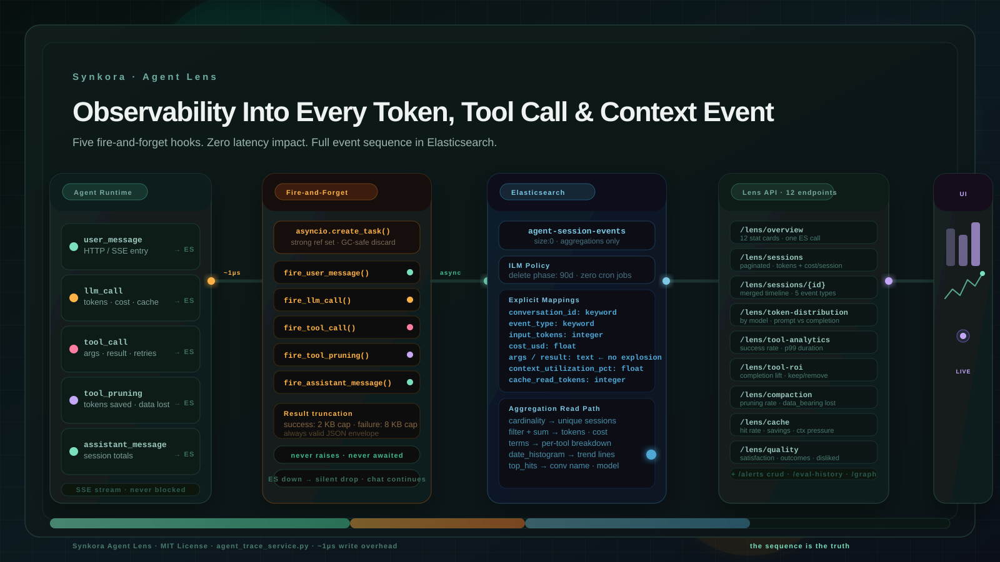

A user filed a support ticket.

Their agent gave a wrong answer. Not a hallucination — a factually incorrect summary of data the agent had explicitly retrieved two turns earlier.

We looked at the logs.

The agent called the right tool. The tool returned the right data. The model responded confidently with the wrong answer.

We had no idea why.

<!-- truncate -->

:::eyebrow
On building full event-sequence observability into Synkora's agent runtime
:::


:::brush-title
a token count
tells you nothing.
the sequence
tells you everything.
:::


*We spent two hours in that support ticket before we found it: context pruning had fired on turn 8 and truncated the SQL result the agent was summarizing on turn 12. The data was there. Then it wasn't. The model never knew the difference.*

*That was the day we built Agent Lens.*



*Five event types — user message, LLM call, tool call, pruning pass, assistant message — flow into Elasticsearch via fire-and-forget hooks. The read path is pure ES aggregations. Zero document fetches. Zero latency impact on the stream.*


## You Are Flying Blind

Standard LLM observability tools track one thing: the LLM call.

Request in. Tokens counted. Response out.

For a chatbot that calls the model once and responds, that is enough.

For an agent — a system that might make fifteen model calls, execute a dozen tool invocations, retry failures, compact context, and produce a final response only after all of that — it is nearly useless.

Consider what happens on a single "pull last quarter sales by region" message in a moderately complex agent:

- One LLM call to decide which tool to invoke
- A database query that fails on the first try, retries, succeeds on the second
- A second LLM call to interpret the query results
- Context pruning fires because the conversation grew too large
- A third LLM call — now working with a truncated version of the results
- The final answer, delivered confidently, based on incomplete data

Your observability dashboard shows: 14,200 tokens. $0.003. 1.8 seconds.

It does not show that the result was truncated. It does not show the retry. It does not show that the model's final reasoning step was working with 40% of the data it thought it had.

That is not observability. That is a receipt.


:::centered-statement
the agent does not fail loudly.
it drifts.
quietly.
across the context window.
:::


## Why Elasticsearch, Not More PostgreSQL Tables

The first instinct was PostgreSQL.

We already have it. Messages, conversations, LLM usage records — all in Postgres. Add a table for agent events. Run some queries. Done.

We built that version. It still exists — `agent_tool_call_log` is a real PostgreSQL table, backing the tool analytics endpoint today. But the moment we defined what the overview panel needed to answer, Postgres stopped feeling right.

Twelve metrics. One panel. Every page load.

Total sessions in the window. Total LLM calls. Input tokens. Output tokens. Cost. Average latency. Total tool calls. Failed tool calls. Average tool duration. Failure rate. Cost per session. Session count.

In PostgreSQL that is four or five queries across three tables, with joins, group-bys, and window functions — running against millions of rows for any agent with real usage. Or one nightmare CTE that takes a week to write and a month to debug when usage patterns change.

In Elasticsearch it is one request:

```python
# api/src/services/agents/agent_trace_service.py

body = {
    "size": 0,   # return aggregations only — no document bodies, no network waste
    "query": {"bool": {"filter": _base_filter(tenant_id, agent_id, start, end)}},
    "aggs": {
        "total_sessions": {"cardinality": {"field": "conversation_id"}},
        "llm_stats": {
            "filter": {"term": {"event_type": "llm_call"}},
            "aggs": {
                "count":       {"value_count": {"field": "event_type"}},
                "input_tokens": {"sum": {"field": "input_tokens"}},
                "output_tokens": {"sum": {"field": "output_tokens"}},
                "cost":        {"sum": {"field": "cost_usd"}},
                "avg_latency": {"avg": {"field": "latency_ms"}},
            },
        },
        "tool_stats": {
            "filter": {"term": {"event_type": "tool_call"}},
            "aggs": {
                "total":       {"value_count": {"field": "event_type"}},
                "failed":      {"filter": {"term": {"success": False}},
                                "aggs": {"count": {"value_count": {"field": "event_type"}}}},
                "avg_duration": {"avg": {"field": "duration_ms"}},
            },
        },
    },
}
```

`size: 0` means Elasticsearch returns nothing but aggregation results. No document scanning. No rows fetched. The `cardinality` aggregation counts distinct sessions using HyperLogLog++ — sub-millisecond regardless of how many events are in the index. A `COUNT(DISTINCT conversation_id)` in PostgreSQL needs a full scan or a precomputed rollup.

The second reason: retention.

Observability data has a natural expiry. Nobody is querying events from 90 days ago. In PostgreSQL, enforcing that means a scheduled delete job, partitioned tables, or unbounded growth. In Elasticsearch it is an ILM policy, written once on startup:

```python
# api/src/services/agents/agent_trace_setup.py

policy_body = {
    "policy": {
        "phases": {
            "delete": {
                "min_age": f"{retention_days}d",
                "actions": {"delete": {}},
            }
        }
    }
}
await es.ilm.put_lifecycle(name="agent-trace-ilm", body=policy_body)
```

`AGENT_TRACE_RETENTION_DAYS` defaults to 90. Set it to 30 for cost, 365 for compliance. The policy is idempotent. No cron job. No partition maintenance. It just works.


:::ink-band
`size: 0` changed
how we think about analytics.
ask the index.
don't scan the rows.
:::


## The Write Path: ~1µs and Never Blocks

The hardest constraint was non-negotiable from day one.

Observability must not slow down the agent.

A user waiting on an SSE stream does not care about your metrics pipeline. Every millisecond added to the write path is a millisecond they feel. We needed a write path that effectively costs nothing.

The answer is `asyncio.create_task`. You schedule a coroutine, it runs when the event loop has capacity, and your current call returns immediately. The catch — and this is the part most implementations get wrong — is garbage collection.

`asyncio.create_task` alone is not safe. Python's GC can collect a task before it finishes if nothing holds a reference to it. The task silently disappears. The event is never written. You never know.

The fix is a module-level strong-reference set:

```python
# api/src/services/agents/agent_trace_service.py

_trace_bg_tasks: set[asyncio.Task] = set()

def _fire_index_event(event: dict) -> None:
    """Returns in ~1µs. Never raises. Never blocks."""
    try:
        task = asyncio.create_task(_index_event(event))
        _trace_bg_tasks.add(task)                          # hold strong reference
        task.add_done_callback(_trace_bg_tasks.discard)   # release on completion
    except Exception as e:
        logger.warning("_fire_index_event scheduling error: %s", e)
```

`_trace_bg_tasks.add(task)` keeps the task alive. `add_done_callback(_trace_bg_tasks.discard)` removes it when the task finishes, preventing the set from growing unboundedly. If Elasticsearch is down, `_index_event` logs a warning and exits silently. The chat stream continues. You lose some observability data. That tradeoff is explicit and correct — blocking a user's response to retry a metrics write is the wrong priority inversion.

This pattern is borrowed from `llm_cost_service.py`, where we use it for billing persistence. One pattern. Two callsites. The same guarantees.

Five event types flow through this path on every session:

| Event | Fired from | What it captures |
|---|---|---|
| `user_message` | Stream entry | Content preview, conversation name, status |
| `llm_call` | After each model response | Tokens, cost, latency, model, cache hits, context pressure |
| `tool_call` | After each tool execution | Tool name, args, result, success/fail, duration, retries |
| `tool_pruning` | After each context compaction pass | Turn index, results pruned, tokens saved, data-bearing count |
| `assistant_message` | SSE stream close | Session totals: tokens, cost, latency |

Each event carries a `sequence` counter — a monotonically incrementing integer per session. This is what makes the timeline reconstructable. Events may arrive in Elasticsearch slightly out of order due to async scheduling. The sequence re-sorts them into the correct causal order.


## The Mapping Trap We Avoided

Elasticsearch's dynamic mapping is a disaster for tool data.

Index a document with `tool_result: {"rows": [...], "columns": [...]}` and Elasticsearch recurses into the object, infers types for every key it finds, and creates a mapping entry per nested field. A SQL query result with 40 columns creates 40 mapping entries. Multiply by hundreds of distinct tools and your mapping grows to thousands of fields — which creates cluster-wide CPU pressure and makes aggregation queries unpredictable.

The solution: never let Elasticsearch see structured objects for variable-content fields.

Tool arguments and results are serialized to JSON strings before indexing, then stored as `text` fields:

```python
# Serialize result as a JSON string — stored as `text`, not `object`
encoded = json.dumps(result, default=str)

# Two limits: failure path needs more context for debugging
_FAILED_MAX = 8_000
_SUCCESS_MAX = 2_000
limit = _FAILED_MAX if not success else _SUCCESS_MAX

if len(encoded) > limit:
    # Wrap in an envelope — raw [:N] slicing produces invalid JSON
    result_preview = json.dumps(
        {"_truncated": True, "preview": encoded[:limit], "total_chars": len(encoded)},
        default=str,
    )
else:
    result_preview = encoded
```

The truncation envelope matters. A naive `encoded[:2000]` produces invalid JSON if the cut lands inside a string value or nested object. The frontend's `JSON.parse` fails. The developer sees a raw unreadable blob instead of a formatted object. Wrapping in `{"_truncated": true, "preview": "...", "total_chars": N}` guarantees the stored string is always parseable — regardless of where the cut falls.

The 8,000-character limit on failed calls is also deliberate. When a tool fails, the error is often in the middle of the response. Cutting at 2,000 characters might discard the part you need to debug it.

Every field that participates in aggregations is explicitly mapped. No inference. No surprises:

```python
# api/src/services/agents/agent_trace_setup.py

"properties": {
    "tenant_id":            {"type": "keyword"},
    "conversation_id":      {"type": "keyword"},
    "event_type":           {"type": "keyword"},
    "model":                {"type": "keyword"},
    "tool_name":            {"type": "keyword"},
    "input_tokens":         {"type": "integer"},
    "output_tokens":        {"type": "integer"},
    "latency_ms":           {"type": "integer"},
    "cost_usd":             {"type": "float"},
    "cache_read_tokens":    {"type": "integer"},
    "context_utilization_pct": {"type": "float"},
    "success":              {"type": "boolean"},
    "args":                 {"type": "text"},    # JSON string — not object
    "result":               {"type": "text"},    # JSON string — not object
}
```

The template is applied once on startup via `_ensure_index_template`. Idempotent. Safe to re-run on every restart.


:::centered-statement
dynamic mapping is a gift
for prototypes.
it is a tax
on production clusters.
:::


## Three Numbers You Cannot Get From Token Counts

Once the event sequence is in Elasticsearch, three analytics surfaces become possible that simply do not exist in standard LLM tracing.

### 1. Prompt Cache Hit Rate

Anthropic charges 10% of normal input token prices for cache reads. On a long system prompt sent on every turn of a 30-turn session, caching can eliminate 60–70% of input token cost after the first turn.

But you cannot know your cache hit rate unless you capture the two fields Anthropic returns on every usage object: `cache_read_input_tokens` and `cache_creation_input_tokens`. We capture both on every `llm_call` event and surface them in the `/lens/cache` endpoint.

What it reveals: three agents had cache hit rates near zero. Reason: their system prompts were being dynamically assembled with per-request content — timestamps, user names, live database values — which invalidated the cache on every single turn. Fixing that brought cache hit rates to 67% and cut those agents' input token costs by more than half.

### 2. Tool ROI

Every agent has tools that help and tools that don't.

The Tool ROI endpoint does something no standard observability system does: it splits sessions into two groups — sessions where a tool was called, and sessions where it was never called — then compares completion rate, average cost, and average LLM call count between the groups.

```python
# api/src/services/agents/agent_trace_service.py  (get_tool_roi)

completion_lift = completion_rate_with - completion_rate_without

if completion_lift > 0.05 and error_rate < 0.1:
    verdict = "keep"
elif completion_lift < -0.05 or error_rate > 0.3:
    verdict = "remove"
elif error_rate > 0.15 or cost_impact_pct > 50:
    verdict = "review"
else:
    verdict = "neutral"
```

`completion_lift` is the key signal. A positive lift means sessions that used the tool resolved successfully at higher rates. A negative lift means the tool is actively making sessions worse — the model spends LLM calls retrying it, context fills with error messages, and the session degrades.

Two tools came back `remove` in the first week of data. Error rates of 41% and 28%. Sessions that called either of them completed at 18 percentage points lower rates than sessions that didn't. They had been in the config for months. Nobody knew.

### 3. When Context Collapse Silently Breaks Answers

This is the one that started everything.

Every time the context pruner runs, a `tool_pruning` event is indexed with one critical field: `data_bearing_pruned`. It counts how many results from data-bearing tools — SQL queries, file reads, database fetches — were truncated in this pruning pass.

```python
def fire_tool_pruning(
    *,
    turn_index: int,
    tool_results_pruned: int,
    data_bearing_pruned: int,   # the dangerous number
    estimated_tokens_saved: int,
    ...
) -> None:
```

When `data_bearing_pruned > 0`, the model has lost structured data it was working with. It does not know the data is gone. It continues reasoning. The answer it produces is based on a context that no longer reflects what the tool actually returned.

In the `/lens/compaction` endpoint, this surfaces as a daily trend. If `data_bearing_pruned` is spiking, those are days your agent was quietly producing worse answers.

In a single 7-day production window:

| Metric | Value |
|---|---|
| Sessions with pruning triggered | 34% |
| Data-bearing results truncated | 312 |
| Estimated tokens saved by pruning | 2.1M |
| Days where data_bearing_pruned > 20 | 3 |

312 moments in one week where the agent was reasoning from incomplete data. No error was thrown. No log line indicated a problem. Users got responses that looked correct.


:::ink-band
the agent does not tell you
when the data disappears.
the event sequence does.
:::


## The Timeline: Reading a Session Like a Story

The session detail endpoint does not return messages.

It returns a timeline — every event in the session merged into a single chronological sequence, sorted by the `sequence` counter, with every field that was captured on each event type.

A real 12-event session:

```
seq=1  user_message      "pull last quarter sales by region"
seq=2  llm_call          gpt-4o · 1,840 tokens · 312ms · ctx=14%
seq=3  tool_call         internal_execute_query · 89ms · success=true
seq=4  llm_call          gpt-4o · 3,210 tokens · 445ms · ctx=24%
seq=5  tool_call         internal_execute_query · 1,203ms · success=false
seq=6  tool_call         internal_execute_query · 892ms · success=true · retries=1
seq=7  llm_call          gpt-4o · 5,940 tokens · 601ms · ctx=46%
seq=8  tool_pruning      turn=7 · pruned=3 · data_bearing=1 · saved=4,200 tokens
seq=9  llm_call          gpt-4o · 3,880 tokens · 398ms · ctx=29%
seq=10 tool_call         internal_fetch_chart · 234ms · success=true
seq=11 llm_call          gpt-4o · 4,120 tokens · 521ms · ctx=32%
seq=12 assistant_message total: 19,200 tokens · $0.0038 · 2,580ms
```

Sequence 8 is the event that makes the support ticket solvable. Pruning fired on turn 7. One data-bearing result was truncated. Context dropped from 46% to 29% on the very next LLM call — confirming the pruner worked, and confirming what was lost. The tool failure at sequence 5 and the retry at sequence 6 are two separate events, not collapsed into one.

This is the difference between a log and an explanation.


## What Changed

Before Agent Lens: we knew agents were working because users weren't complaining loudly enough.

After it:

We found `internal_fetch_web_search` was timing out on 22% of calls. Not visible in error rates because timeouts were caught and returned as graceful failures. Visible in the tool analytics endpoint as `avg_duration_ms: 8,400` against a 10-second timeout — right at the edge, half the time.

We found that context pruning was truncating SQL results on sessions longer than 18 turns for one specific agent. Not every session. Only long ones, where accumulated tool results pushed context past the pruning threshold. The compaction trend showed it clearly on day 4.

We found three agents with broken cache configurations. Cache hit rate: 4%. After removing dynamic content from their system prompts: 67%.

None of those showed up in error logs. None triggered alerts. None were reported by users who had no way to articulate "the agent gave me a 90% correct answer instead of a 100% correct one."

The implementation is four files. Two environment variables. Optional Elasticsearch — the tool analytics endpoint falls back to PostgreSQL if ES is not configured.

```bash
AGENT_TRACE_ENABLED=true
AGENT_TRACE_RETENTION_DAYS=90
```

With `AGENT_TRACE_ENABLED=false`, every fire function returns at its first line. No task. No overhead. No data written. The feature costs nothing when it is off.

It costs approximately one microsecond when it is on.


:::ink-band
observability that slows the agent
is not a feature.
it is a tradeoff you have not admitted to yet.
:::


The implementation lives in `api/src/services/agents/agent_trace_service.py` (write + read path), `agent_trace_setup.py` (ES bootstrap), `controllers/agents/agent_lens.py` (12 endpoints), and `schemas/agent_lens.py` (Pydantic models). MIT license. No external dependencies beyond the `elasticsearch` Python client.
