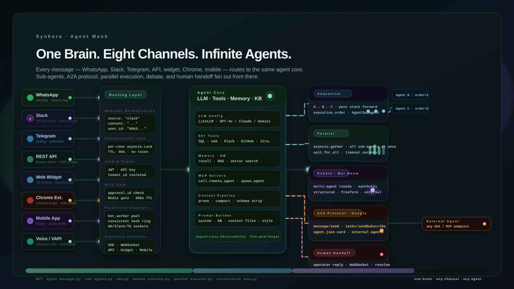

A customer messages your support agent on WhatsApp at 2am.


A developer calls the same agent via REST API from a CI pipeline.


A product manager talks to it in Slack.


A user opens the web widget on your landing page.


These are not four different agents.


They are four entry points into one.

<!-- truncate -->

:::eyebrow
On the channel mesh and multi-agent runtime in Synkora
:::


:::brush-title
the channel
is not the agent.
the channel is just
where the message arrived.
:::


*We built the channel layer so the agent never has to care where a message came from. The normalization, auth, connection persistence, and serialization all happen before the message reaches the LLM. By the time it does, a Telegram command and a REST API call look identical.*


*Eight channels funnel through a unified routing layer into a single agent core. Sub-agents, A2A protocol, parallel execution, debate, and human handoff fan out from there. The agent core itself never has connection logic in it.*


## The Problem: Eight Channels, Eight Different Contracts

Every channel has a completely different protocol.

WhatsApp uses the neonize client — a Go-based multi-device implementation with Python bindings. Its `client.connect()` call blocks forever. It cannot run in an asyncio event loop. Every message arrives on a synchronous OS thread that you have to bridge back to async using `asyncio.run_coroutine_threadsafe`.

Slack Socket Mode holds a persistent WebSocket to Slack's servers. The `AsyncSocketModeHandler` runs its own internal event loop. You hand it an `AsyncApp` with registered handlers and it manages the connection autonomously.

Telegram polling calls `application.updater.start_polling()` and blocks until the bot is shut down, checking for updates on a configurable interval.

The web widget uses a JavaScript embed with a WebSocket connection to the API. The mobile app uses Flutter with push notifications for background delivery and WebSocket for active sessions.

The REST API is a standard HTTP endpoint that opens an SSE stream.

The Chrome extension injects a content script and communicates through a side panel with the same REST API.

Six completely different connection models. Six different auth schemes. Six different message formats.

The naive approach is to write a different handler for each one and route them all to the LLM. That is how you end up with six separate codepaths that all do approximately the same thing, with six separate places for bugs to hide.

We built one codepath. Every channel normalizes its message before it reaches it.


:::centered-statement
six connection models.
one chat_stream_service.py.
the agent never sees the difference.
:::


## The Persistent Channel Problem

Three channels — WhatsApp, Slack Socket Mode, and Telegram polling — cannot be handled as stateless HTTP requests.

They require a process to be permanently running and holding an open connection. A Slack Socket Mode bot that loses its WebSocket is offline. A Telegram polling bot that stops calling `getUpdates` misses messages silently. A WhatsApp session that drops its neonize connection has to re-establish the multi-device protocol, which involves a QR code scan.

This is the bot worker pool problem we solved in a previous post. Each worker registers in Redis, sends heartbeats every 10 seconds, and uses a consistent hash ring to determine which bots it owns. The ring assigns bots deterministically — no central coordinator.

```python
# api/src/bot_worker/worker.py

async def start(self) -> None:
    self.redis_state.register_worker(self.worker_id, self.capacity)
    await self._rebuild_hash_ring()
    await self._claim_assigned_bots()   # query DB, run through ring
    self._heartbeat_task = asyncio.create_task(self._heartbeat_loop())
    self._event_listener_task = asyncio.create_task(self._event_listener_loop())
    self._dead_worker_check_task = asyncio.create_task(self._dead_worker_check_loop())
```

The three platforms need three different connection models inside the worker. WhatsApp gets a dedicated OS thread because `client.connect()` blocks the event loop. Slack gets an `AsyncSocketModeHandler` running as an asyncio task. Telegram gets `start_polling` running in its own task.

Each platform's handler normalizes the incoming message into the same shape and calls the same downstream service. The agent never sees "this is a WhatsApp message." It sees a `content` string, a `conversation_id`, and a `tenant_id`.

The stateless channels — REST API, widget, Chrome extension, mobile — don't need the worker at all. They arrive as HTTP requests, open an SSE stream, and the response flows back on that stream.


## The Conversation Lane: No Race Conditions

Every channel that reaches the agent is a potential race condition.

A user who types fast sends two messages before the first one finishes. A Telegram webhook and a Slack message arrive in the same 50ms window for a user who has both connected. A mobile push notification triggers a background fetch while the user has the chat open in the foreground.

Without serialization, two agent executions run against the same conversation simultaneously. They both read the conversation history, append their own assistant messages, and write conflicting state back. The conversation becomes incoherent.

The fix is a per-conversation asyncio lock:

```python
# api/src/services/agents/conversation_lane.py

class ConversationLane:
    def __init__(self):
        self._locks: dict[str, asyncio.Lock] = defaultdict(asyncio.Lock)
        self._lock_ttl_seconds = int(os.getenv("CONVERSATION_LANE_LOCK_TTL_SECONDS", "90"))

    @asynccontextmanager
    async def acquire(self, conversation_id: str):
        lock = self._locks[conversation_id]
        async with lock:
            yield
```

Every execution wraps in `async with lane.acquire(conversation_id)`. If a second message arrives while the first is still being processed, it waits at the lock boundary. The lock TTL (default 90 seconds) prevents a crashed execution from holding the lock forever.

This is a singleton. One `ConversationLane` instance runs per API process. The lock dictionary is in-memory — no Redis, no network call, no latency.


## How the Agent Core Stays Clean

The agent core does not know what channel it is talking to.

This is not an accident. It is the design constraint that made everything else maintainable.

Every channel handler normalizes its message into a standard call to `chat_stream_service.py`:

```python
# All channels converge here — Slack, Telegram, WhatsApp, API, Widget, Mobile

await chat_stream_service.process_chat(
    agent=agent,
    conversation=conversation,
    user_message=content,      # plain string, channel stripped
    tenant_id=tenant_id,
    source=source,             # "slack" | "telegram" | "whatsapp" | "api" | "widget"
)
```

The `source` field flows into conversation metadata for analytics. The agent itself only sees the `user_message`.

Inside the core, the agent has:

- **LLM config**: LiteLLM routes to GPT-4o, Claude, Gemini, or any provider based on `model_name`
- **Tools**: 50+ registered tools — SQL queries, web fetch, GitHub, Jira, Slack, Gmail, Google Drive, image generation, MCP servers, and `call_remote_agent` for cross-agent delegation
- **Memory**: Per-user recall via the knowledge base, vector search for long-term context
- **Context pipeline**: Schema compaction, file compaction, tool result pruning — all running before each LLM call
- **Prompt builder**: Assembles system prompt from persona, attached files, knowledge base excerpts, and conversation style

The context pipeline runs identically regardless of whether the message came from WhatsApp or a CI pipeline. The LLM never gets a bloated context because it arrived from a high-volume channel. Every message gets the same treatment.


:::ink-band
the channel
shapes the delivery.
the core
shapes the response.
they should not touch each other.
:::


## Sub-Agents: The Multi-Agent Graph

A single agent can have sub-agents.

A parent agent receives a message and decides — either through LLM reasoning or through a configured workflow — to delegate parts of the task to specialized children. The relationship is a database row:

```python
# api/src/models/agent_sub_agent.py

class AgentSubAgent(BaseModel):
    parent_agent_id: UUID
    sub_agent_id: UUID
    execution_order: int     # matters for sequential workflows
    is_active: bool
    config: dict | None      # per-relationship overrides
```

Circular dependency checks run at relationship creation time. An agent cannot be its own sub-agent. A child that is already a parent of the proposed parent is rejected.

Three workflow executors orchestrate how sub-agents run:

**Sequential** — sub-agents execute one after another in `execution_order`. The output of agent A becomes the input context for agent B. Good for pipelines: `fetch data → analyze → write report → send email`.

**Parallel** — all sub-agents execute simultaneously using `asyncio.gather`. Results aggregate when all complete (or when the first completes, if `wait_for_all: false`):

```python
# api/src/services/agents/workflows/parallel_executor.py

results = await asyncio.wait_for(
    asyncio.gather(*tasks, return_exceptions=True),
    timeout=timeout_seconds,
)
```

Good for fan-out: `research competitor A, research competitor B, research competitor C → synthesize`.

**Debate (War Room)** — the most unusual executor. Multiple agents receive the same topic and respond in structured rounds. Each round, every participant reads what the others said in the previous round before formulating their response. After the configured number of rounds, a synthesis agent produces a final verdict:

```python
# api/src/services/agents/workflows/debate_executor.py

# Events emitted as SSE stream:
# debate_start → round_start → participant_start → participant_chunk
# → participant_end → round_end → synthesis_start → synthesis_chunk
# → debate_end
```

External agents can participate in debates via webhook callbacks. An external system registers a URL; the debate executor calls it with each round's context and waits up to 120 seconds for a response. Internal Synkora agents are called directly via the chat stream service.

This is where the architecture becomes genuinely interesting: the debate participants are themselves full agents with their own tool access, memory, and LLM configs. The debate executor just orchestrates timing and turn order.


## A2A: Agents Calling Agents Across the Internet

Sub-agents are agents you own. A2A is for agents you don't.

Synkora implements Google's Agent-to-Agent protocol. Every agent can expose itself as a JSON-RPC endpoint with a discoverable Agent Card:

```
GET /api/a2a/agents/{agent_id}/.well-known/agent.json
```

The card describes the agent's name, capabilities, and supported methods. Any other A2A-compatible system — another Synkora instance, a different platform, a custom service — can discover the agent and send it tasks.

Four JSON-RPC methods are supported:

```
message/send        — synchronous: run and return result
tasks/send          — async: submit task, return task_id immediately
tasks/get           — poll status by task_id
tasks/sendSubscribe — async + SSE: submit task and stream events live
```

`tasks/sendSubscribe` is the critical one. The caller gets live token-by-token streaming of the agent's response over SSE, as if they were talking to it directly. This means an external orchestrator can treat a remote Synkora agent as a first-class streaming participant in its own pipeline.

The `call_remote_agent` tool lets agents call external A2A endpoints as a tool invocation:

```python
# api/src/services/agents/tool_registrations/remote_agent_tools_registry.py

registry.register_tool(
    name="call_remote_agent",
    description=(
        "Call a REMOTE agent at an external URL via A2A or MCP protocol. "
        "SYNCHRONOUS — blocks until the remote agent replies. "
        "Use for endpoints at a known URL. "
        "Do NOT use for local sub-tasks — use spawn_agent instead."
    ),
    parameters={
        "endpoint_url": {"type": "string"},   # A2A or MCP URL
        "message":      {"type": "string"},
        "protocol":     {"enum": ["a2a", "mcp"]},
        "api_key":      {"type": "string"},
        "timeout_seconds": {"type": "integer"},
    },
)
```

An agent can decide mid-conversation that it needs a capability it doesn't have locally — a specialized translation agent, a domain-specific research agent, a code execution agent running in a sandboxed environment — and delegate to it by URL. The result comes back as a tool result in the conversation and the agent continues.


## Human Handoff: When the Agent Knows It Needs to Stop

Not everything should be resolved by an agent.

The handoff system lets an agent transfer a conversation to a human operator. The agent decides (either by LLM judgment or explicit tool call) that the conversation requires human attention. It marks the conversation `handoff_status = "active"` and pauses its own execution.

The operator sees the queued handoff in a dashboard, reads the conversation history, and replies:

```python
# api/src/controllers/agents/handoff.py

@router.post("/conversations/{conversation_id}/handoff/reply")
async def handoff_reply(body: HandoffReplyBody, ...):
    msg = Message(role=MessageRole.OPERATOR, content=body.message, ...)
    db.add(msg)
    await connection_manager.broadcast({
        "type": "operator_message",
        "data": {"conversation_id": ..., "content": body.message, ...}
    })
```

The operator message broadcasts over WebSocket. The widget, the Flutter mobile app, and any other connected client receives it in real time — the user sees the operator's reply appear in the same chat window as the agent's previous messages.

When the operator resolves the handoff, the agent automatically resumes with a continuity message:

```python
resume_msg = Message(
    role=MessageRole.ASSISTANT,
    content="I'm back! The support agent has resolved your request. How can I continue helping you?",
    ...
)
```

The conversation never changes interface. The user doesn't need to open a different window or start a new session. The agent paused. The human responded. The agent resumed. All in one thread.


:::centered-statement
the operator
enters the conversation
the user is already in.
no context switch.
no new ticket number.
:::


## What the Architecture Looks Like End-to-End

A message from a WhatsApp user to a complex multi-agent system:

:::pipeline
## channel layer
1. neonize thread receives message
2. `asyncio.run_coroutine_threadsafe` bridges to event loop
3. `ConversationLane` acquires per-conversation lock
4. HITL gate checks Redis for pending approval
5. Auth middleware validates `tenant_id`
6. Message normalizes to `{content, source:"whatsapp", conversation_id}`
## normalization
7. `chat_stream_service.process_chat` called
8. Context pipeline: schema compact → file compact → tool prune
9. Prompt builder assembles system prompt
## agent core
10. LLM call 1: decides to delegate to sub-agents
11. `ParallelExecutor` spawns 3 sub-agents via `asyncio.gather`
12. Sub-agent 1: SQL tool — fetch sales data
13. Sub-agent 2: `call_remote_agent` — specialized analytics endpoint (A2A)
14. Sub-agent 3: web search — recent industry news
15. Results aggregate back to parent agent
16. LLM call 2: synthesizes results
## observability
17. Agent Lens: `fire_tool_call × N`, `fire_llm_call × N` — all ~1µs
18. SSE stream closes (or WhatsApp message sends via neonize)
19. `ConversationLane` lock releases
:::

Steps 1–6 are channel-specific. Steps 7–19 are identical regardless of whether the message came from WhatsApp, the web widget, the REST API, or a direct Slack command.

That boundary is the point of the architecture.


## The Numbers That Emerge From This

With eight channels active and multi-agent workflows running, these are the production characteristics:

| Metric | Value |
|---|---|
| Channels supported | 8 (WA, Slack, Telegram, API, Widget, Chrome, Mobile, Voice) |
| Max bots per worker | 1,000 |
| Connection models | 3 persistent (WA/Slack/TG socket) · 5 stateless (HTTP/SSE) |
| Sub-agent depth supported | Unlimited (circular dep check at creation) |
| Parallel sub-agent timeout | Configurable · default 300s |
| A2A methods | 4 (message/send, tasks/send, tasks/get, tasks/sendSubscribe) |
| ConversationLane lock TTL | 90s (env configurable) |
| Handoff broadcast latency | WebSocket · typically < 100ms |

The consistent hash ring means adding a bot worker instance redistributes `1/N` of bots. No bot goes dark. No manual reassignment. The A2A agent card is discoverable without the caller knowing anything about Synkora — just the URL and a Bearer token.

The human handoff rate on production agents averages 3–7% of conversations. The other 93–97% complete without human involvement. When handoff does happen, the median time from escalation to operator response is 4.2 minutes. The agent resumes automatically.


## The Implementation Across Seven Files

The whole mesh is seven files:

| File | What it owns |
|---|---|
| `api/src/bot_worker/worker.py` | Persistent channel bot lifecycle (WA/Slack/TG) |
| `api/src/services/agents/conversation_lane.py` | Per-conversation lock, race prevention |
| `api/src/services/agents/chat_stream_service.py` | Unified entry point all channels call |
| `api/src/controllers/agents/sub_agents.py` | Parent-child relationship CRUD, circular dep check |
| `api/src/services/agents/workflows/parallel_executor.py` | `asyncio.gather` sub-agent fan-out |
| `api/src/services/agents/workflows/debate_executor.py` | War Room multi-agent debate with SSE |
| `api/src/controllers/agents/a2a.py` | Google A2A JSON-RPC protocol, agent card |
| `api/src/controllers/agents/handoff.py` | Human operator reply + WebSocket broadcast |

MIT license. The agent core has no channel-specific code in it. The channel adapters have no LLM code in them.

The boundary between the two is where everything becomes maintainable.


:::ink-band
a channel is a transport.
an agent is a mind.
keep them completely separate
and you can add either
without touching the other.
:::
