A developer opened a support ticket last month.

Their agent had just started creating GitHub pull requests, labeling Jira issues, and querying their internal database — all in one conversation.

They hadn't asked us to add any of those integrations.

They had attached three MCP servers.

<!-- truncate -->

:::eyebrow
On building production MCP server support in Synkora
:::


:::brush-title
the protocol
is the integration.
connect a server,
get every tool it exposes.
:::


*We spent eighteen months building 50+ internal tools — SQL runner, web search, image generation, GitHub, Jira, Gmail, Slack. Each one required code. Each one required maintenance. Then Anthropic published MCP, and we built a client that makes adding an external tool server a database operation, not a deploy.*


*Two transports (HTTP and stdio), one client, one tool registry. MCP tools appear alongside internal tools in every LLM call.*


## The Problem: N × M Integration Hell

Every AI platform eventually hits the same wall.

You have N agents. Each agent needs access to M external services. GitHub, Linear, Notion, Salesforce, your internal APIs, your database, your company wiki. Every new service needs an OAuth flow, a rate limiter, a schema adapter, a retry policy, error handling, and test coverage.

That is N × M integrations, maintained in perpetuity.

Anthropic's Model Context Protocol inverts the model.

Instead of the platform implementing integrations, the tool server implementes the MCP protocol. The platform implements one client. Every MCP-compatible server — and there are hundreds, from Anthropic, from GitHub, from the community — instantly works with every agent.

The platform's job collapses from "build all integrations" to "speak MCP correctly."


:::centered-statement
one client.
every server.
forever.
:::


## Two Transports, One Mental Model

MCP supports two fundamentally different ways to connect.

**HTTP** — you point the client at a URL. The server lives somewhere on the internet. Authentication is headers. The client sends JSON-RPC over HTTP. This is how you connect to hosted MCP services: a GitHub MCP server running on your infra, a Notion MCP service at a known endpoint, a custom API that speaks MCP.

**stdio** — you give the client a command. It spawns a subprocess. Messages flow over stdin and stdout. This is how you connect to local MCP packages:

```bash
npx -y @modelcontextprotocol/server-github
```

That command installs and runs the official GitHub MCP server as a child process of the API server. It does not require a running server, a port, or a deploy. The MCP client launches it, talks to it over pipes, and tears it down when done.

Both transports expose exactly the same `list_tools` and `call_tool` interface.

```python
# api/src/services/mcp/mcp_client.py

def _create_transport(self, server: MCPServer):
    transport_type = getattr(server, "transport_type", "http")

    if transport_type == "stdio":
        # Spawn a child process — npx, python, node, anything
        env = dict(os.environ)
        if server.env_vars:
            env.update(server.env_vars)
        return StdioTransport(command=server.command, args=server.args or [], env=env)
    else:
        # HTTP with headers and optional Bearer auth
        headers = self._build_headers(server)
        auth = None
        if "Authorization" in headers:
            auth_header = headers.pop("Authorization")
            if auth_header.startswith("Bearer "):
                auth = auth_header[7:]
        return StreamableHttpTransport(server.url, headers=headers, auth=auth)
```

The `MCPServer` database model stores both configurations in the same table. `transport_type` is the discriminator. Everything else — `command`, `args`, `env_vars` for stdio; `url`, `auth_config`, `headers` for HTTP — is nullable, populated depending on which transport you use.

The three sensitive fields (`auth_config`, `env_vars`, `headers`) are Fernet-encrypted at rest using the same `encrypt_value`/`decrypt_value` pattern that protects OAuth tokens and database passwords across the platform. The columns store `enc:<fernet_token>` strings; `@property` getters on the model decrypt transparently on read and encrypt on write. Existing rows without encryption are read correctly as plain JSON and re-encrypted on the next write. Raw credentials never touch a log file or appear in the LLM's context window.


## Multi-Server, Single Client

An agent can have many MCP servers.

A research agent might have: an HTTP server for web content extraction, a stdio process for the official Brave Search MCP server, and an internal HTTP server for your company knowledge base.

Three different servers. Two different transports. All providing tools to the same agent.

The naive implementation creates one client per server. That means three connection cycles, three tool discovery calls, three error surfaces. It also means the LLM can't call tools across servers in a single reasoning step without the platform managing cross-server state.

FastMCP handles this with a dict config:

```python
# Single server: pass a transport directly
if len(self.servers) == 1:
    transport = self._create_transport(server)
    self._client_context = Client(transport)
else:
    # Multiple servers: config-based multi-server client
    mcp_config = {"mcpServers": {}}
    for name, server in self.servers.items():
        if transport_type == "stdio":
            env = dict(os.environ)
            if server.env_vars:
                env.update(server.env_vars)
            mcp_config["mcpServers"][name] = {
                "command": server.command,
                "args": server.args or [],
                "env": env,
            }
        else:
            mcp_config["mcpServers"][name] = {
                "url": server.url,
                "headers": headers,
                "auth": auth,
            }
    self._client_context = Client(mcp_config)
```

One `Client` instance. All servers accessible through it. Tool discovery returns the full union. The LLM calls `call_tool(name="github_create_pr", arguments={...})` and FastMCP routes it to the right server.


:::ink-band
the agent calls one tool name.
the client figures out
which server owns it.
:::


## The Client Lifecycle Problem

Clients are not free.

An MCP stdio client spawns a subprocess. An HTTP client opens a connection. Both hold state. You cannot create a new client on every LLM call — the overhead would make the agent unusably slow.

`MCPClientManager` solves this with a per-agent in-memory cache:

```python
# api/src/services/mcp/mcp_client.py

class MCPClientManager:
    def __init__(self):
        self._clients: dict[UUID, MCPClient] = {}

    async def get_agent_client(self, agent_id: UUID, db: AsyncSession) -> MCPClient | None:
        if agent_id in self._clients:
            return self._clients[agent_id]   # already connected

        # Load server config, create client, connect
        servers = await self._load_servers(agent_id, db)
        client = MCPClient(servers=servers, timeout=30, max_retries=3)
        await client.connect()
        self._clients[agent_id] = client
        return client
```

The first call for an agent connects. Every subsequent call in every conversation returns the same connected client.

The tricky part is invalidation.

When you **attach** a new MCP server to an agent, the cached client has an outdated server list. Calling `list_tools` on it will not return the new server's tools. The fix: evict the client entirely.

```python
# api/src/controllers/agents/mcp_servers.py — after attach
await mcp_client_manager.close_agent_client(agent_uuid)
```

The next LLM call will rebuild the client from the database, picking up the new server. One reconnect cost, paid once.

When you **update the tool config** (which tools are enabled, per-agent overrides), you don't need to reconnect — you only need to clear the tool discovery cache. The server hasn't changed:

```python
# After config update — don't reconnect, just clear discovery cache
mcp_client_manager.invalidate_tools_cache(agent_uuid)
```

`invalidate_tools_cache` calls `client._tools_cache.clear()`. The next `discover_tools()` call re-queries the server without disconnecting. For an HTTP server, that is one network round-trip. For stdio, it is one IPC message.

The distinction matters in production. Config updates happen frequently as developers tune which tools an agent should use. Forcing a reconnect on every config change would teardown and restart stdio processes on every save — unacceptably slow.


## The Tool Execution Loop

When the LLM decides to call an MCP tool, the execution path is:

```
LLM response (tool_use block)
  → function_calling.py: execute_tool(name, arguments)
    → mcp_client_manager.get_agent_client(agent_id, db)
    → client.execute_tool(tool_name, arguments)
      → asyncio.wait_for(client.call_tool(...), timeout=120)
      → retry × 3 with exponential backoff (2^attempt seconds)
      → auth error → fail fast (no retry)
  → result flows back into conversation
  → next LLM call
```

The 120-second per-tool timeout is deliberate. MCP tools can be slow — a GitHub tool creating a PR with a review might take 40 seconds. A web content extraction tool might wait for a slow site. The timeout prevents a single sluggish tool call from consuming the entire agent's budget and blocking the conversation lane.

Auth failures get special handling:

```python
_auth_keywords = ("authentication", "unauthorized", "401", "forbidden", "403", "jwt", "token")
if any(kw in error_msg.lower() for kw in _auth_keywords):
    logger.warning(f"MCP auth error for tool {tool_name} (not retrying): {error_msg}")
    break  # fail fast — retries will not fix a bad token
```

A 401 will never succeed on retry. Retrying wastes time and burns rate limit quota. Fail fast, surface the error, let the agent report it.

Transient failures — network hiccups, server restarts, temporary 503s — get full retry with exponential backoff: 1s, 2s, 4s. In practice, the first retry recovers 94% of transient failures.


## The Widget JWT Problem

A customer asked whether their widget users' identities could flow through to their MCP server.

The scenario: a user opens the chat widget on their product. The widget issues a short-lived JWT with the user's ID. The MCP server — their internal API — needs that token in the Authorization header to enforce row-level security and return only that user's data.

The static `auth_config` stored in the database holds a service account token, not a per-user token. Overwriting it with the widget user's JWT would corrupt the shared config.

The solution: build a patched server list for the request, inject the per-request token, create a fresh client that is never cached.

```python
# api/src/services/mcp/mcp_client.py — get_agent_client_with_user_token

import types

patched_servers = []
for assoc in associations:
    server = assoc.mcp_server
    patched_servers.append(
        types.SimpleNamespace(
            name=server.name,
            url=server.url,
            auth_type="bearer",
            auth_config={**(server.auth_config or {}), "token": user_token},
            headers=server.headers,
            transport_type="http",
        )
    )

client = MCPClient(servers=patched_servers, timeout=30, max_retries=3)
await client.connect()
# NOT cached — caller disconnects after the request
return client
```

`types.SimpleNamespace` is not a copy of the SQLAlchemy model — it's a new object with duck-typed attributes that satisfy the same interface. Copying the SQLAlchemy model directly would have shared `_sa_instance_state` between the copy and the original, corrupting the session's identity map and causing hard-to-debug errors on the next database operation.

The patched client lives for exactly one request. The caller disconnects it. The shared cache is untouched.


:::centered-statement
the shared client
holds service credentials.
the per-request client
holds the user's identity.
they never touch each other.
:::


## Schema Compaction for MCP Tools

MCP servers often return verbose tool schemas.

A single GitHub tool schema might have 30 parameters, each with a multi-sentence description explaining what the field does. Sent verbatim to the LLM on every call, those descriptions accumulate into thousands of tokens of context that the model doesn't need after the first turn.

`_compact_schema()` strips parameter-level descriptions while preserving everything the LLM needs to call the tool correctly:

```python
# api/src/services/agents/function_calling.py

def _compact_schema(schema: dict) -> dict:
    result = {}
    for key, value in schema.items():
        if key == "description":
            continue  # strip — model infers from name + type
        elif key == "properties" and isinstance(value, dict):
            result["properties"] = {
                prop_name: _compact_schema(prop_def)
                for prop_name, prop_def in value.items()
            }
        elif key == "items":
            result["items"] = _compact_schema(value) if isinstance(value, dict) else value
        else:
            result[key] = value  # preserve: type, enum, required, default
    return result
```

What it keeps: property names, types, enums (critical — wrong enum values break tool calls), required arrays, default values, nested structures. What it removes: the English prose descriptions on individual parameters.

The tool-level description — the top-level string that tells the LLM *when* to use the tool — is never touched. That stays intact. Only per-parameter prose is stripped.

In production, compacted MCP schemas run 40–65% smaller than their originals by token count. For an agent with five MCP servers averaging 12 tools each, that saves 8,000–12,000 tokens of system context on every LLM call.


:::ink-band
the model knows what to call.
it doesn't need a paragraph
explaining what `repo_name` means.
:::


## What a Full Connection Looks Like

Attaching the official GitHub MCP server to an agent, step by step:

```
1. POST /api/v1/agents/{agent_id}/mcp-servers
   { mcp_server_id: "...", mcp_config: { enabled_tools: ["create_pull_request", "list_issues"] } }

2. AgentMCPServer row inserted (agent_id, mcp_server_id, is_active=true)
3. Cached client for agent_id evicted
4. Next chat request:
   a. get_agent_client(agent_id, db) — cache miss
   b. Load AgentMCPServer associations (selectinload to avoid N+1)
   c. MCPServer.transport_type == "stdio":
      StdioTransport(command="npx", args=["-y", "@modelcontextprotocol/server-github"])
   d. Client.__aenter__() → spawns process → ping → connected
   e. list_tools() → 26 tools discovered, cached
   f. _compact_schema() applied to each → ~47% token reduction
   g. Tools injected into LLM system prompt alongside 50+ internal tools
5. LLM calls create_pull_request(title="Fix memory leak", base="main", ...)
6. asyncio.wait_for(client.call_tool("create_pull_request", {...}), timeout=120)
7. Result: { "html_url": "https://github.com/org/repo/pull/142", "number": 142 }
8. Agent streams: "I've opened PR #142 — Fix memory leak — for your review."
```

From database row to the agent using GitHub. No deploy. No code change. One API call.


## The Numbers

| Metric | Value |
|---|---|
| Transport types | HTTP (StreamableHttp) · stdio (subprocess) |
| Auth schemes | none · bearer · api_key · custom headers |
| Max retries per tool call | 3 (exponential backoff: 1s, 2s, 4s) |
| Per-tool timeout | 120s |
| Tool schema compaction | 40–65% token reduction |
| Client cache hit rate | ~98% (miss only on first call or after attach/detach) |
| First retry success rate | 94% of transient failures |
| Reconnect on config update | Never — cache invalidation only |
| Widget JWT injection | Per-request SimpleNamespace, never cached |

The MCP client manager is a global singleton. One instance per API process. No external coordination, no Redis, no database reads on the hot path after the first call.


## The Three Files

| File | What it owns |
|---|---|
| `api/src/models/mcp_server.py` | Database schema: transport, auth, command, args, env_vars · Fernet encryption of auth_config, env_vars, headers via `@property` getters |
| `api/src/services/mcp/mcp_client.py` | `MCPClient` (connect/execute/retry) · `MCPClientManager` (cache/evict/patch) |
| `api/src/controllers/agents/mcp_servers.py` | CRUD endpoints: attach, detach, list, discover tools, update config |

The function calling handler in `function_calling.py` and `adk_tools.py` call the manager. The rest of the agent core doesn't know MCP exists — it calls `execute_tool(name, arguments)` and gets a result back.


:::ink-band
the agent called a GitHub tool.
the platform called an MCP server.
the developer wrote zero integration code.
that is the protocol doing its job.
:::
